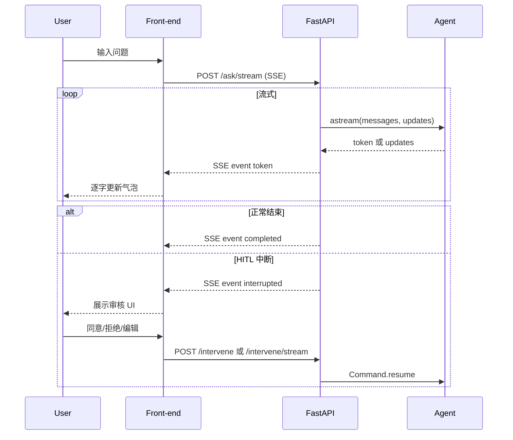

# LangChain V1.x Agent API 服务（流式输出 + HITL + Skill）

## 1、案例介绍

本期视频为大家分享的是在 **12_AgentAPIServerWithSkills** 「带 Skill 按需加载」的 Agent API 服务能力不变的前提下，实现异步流式输出能力          

涉及到的源码、操作说明文档等全部资料都是开源分享给大家的，大家可以在本期视频置顶评论中获取免费资料链接进行下载                      

本期用例新增的核心功能包含：    

- **流式接口**：新增 `POST /ask/stream`，返回 SSE（Server-Sent Events），前端可逐字/逐段展示 Agent 回答
- **HITL 配合**：流式过程中若发生人工审核中断，流会发送 `interrupted` 事件后结束；恢复流程通过 `POST /intervene/stream` 提交决策

### 1.1 架构与数据流



### 1.2 流式输出设计思想

采用 SSE（Server-Sent Events）协议，通过 FastAPI 的 `StreamingResponse` 实现。SSE 是一种用 HTTP 从服务端向客户端单向、持续推送数据的标准方式          

核心思路如下：

1. **异步流式生成**  
   利用 Agent 支持的异步 `astream` 方法，逐步产出消息片段（token、delta、中断等），在服务端实时推送给前端，而不是全部生成完毕后一次性返回，极大提升了响应的实时性和交互体验。

2. **前端无需频繁轮询**  
   前端只需建立一次 SSE 连接，服务端会持续发送事件数据，包括：
   - 普通 token 片段（即 LLM 的回复内容）
   - `interrupted` 事件（遇到人工审核时主动通知前端流程需暂停/介入）
   - `completed` 事件（标志本条对话推理已全部完成）

3. **HITL（Human-In-The-Loop）中断与续流**
   当 Agent 检测到需要人工审核（如工具参数需确认），会通过流发送 `interrupted`，并关闭本次 SSE。  
   前端完成审核后，通过 `/intervene/stream` API 提交人工决策，服务端恢复后续流程，并继续通过 SSE 持续推流，实现多轮人机混合：/ask/stream ——> interrupted ——(人工决策)——> /intervene/stream ——> completed or 再次interrupted

4. **接口及协议设计摘要**
   - `/ask/stream`：与 `/ask` 类似，只是通过 SSE 实时返回（token/completed/interrupted 等事件均包成一条 `data: ...\n\n`）
   - `/intervene/stream`：与 `/intervene` 类似，只是同样通过流实时返回
   - HTTP 头中加入 `Cache-Control: no-cache`/`Connection: keep-alive`，防止网络/代理层缓冲

5. **SSE 事件格式（每行 `data: <JSON>\n\n`）**

| type         | 说明       | 示例 |
| ------------ | ---------- | ---- |
| token        | 模型文本片段 | `{"type": "token", "content": "你好"}` |
| tool_output  | 工具节点返回 | `{"type": "tool_output", "content": "工具执行结果..."}` |
| completed    | 正常结束   | `{"type": "completed", "result": "完整回答文本"}` |
| interrupted  | HITL 中断  | `{"type": "interrupted", "interrupt_details": { "action_requests": [...], "review_configs": [...] }}` |


## 2、准备工作

### 2.1 集成开发环境搭建

anaconda提供python虚拟环境,pycharm提供集成开发环境          

具体参考如下视频:  
【大模型应用开发-入门系列】集成开发环境搭建-开发前准备工作  
[https://www.bilibili.com/video/BV1nvdpYCE33/](https://www.bilibili.com/video/BV1nvdpYCE33/)  
[https://youtu.be/KyfGduq5d7w](https://youtu.be/KyfGduq5d7w)                        

### 2.2 大模型LLM服务接口调用方案

(1)gpt大模型等国外大模型使用方案  
国内无法直接访问，可以使用Agent的方式，具体Agent方案自己选择  
这里推荐大家使用:[https://nangeai.top/register?aff=Vxlp](https://nangeai.top/register?aff=Vxlp)          

(2)非gpt大模型方案 OneAPI方式或大模型厂商原生接口          

(3)本地开源大模型方案(Ollama方式)            

具体参考如下视频:  
【大模型应用开发-入门系列】大模型LLM服务接口调用方案  
[https://www.bilibili.com/video/BV1BvduYKE75/](https://www.bilibili.com/video/BV1BvduYKE75/)  
[https://youtu.be/mTrgVllUl7Y](https://youtu.be/mTrgVllUl7Y)                           

## 3、项目初始化

关于本期视频的项目初始化请参考本系列的入门案例那期视频，视频链接地址如下:             

【EP01_快速入门用例】2026必学！LangChain最新V1.x版本全家桶LangChain+LangGraph+DeepAgents开发经验免费分享  
[https://youtu.be/0ixyKPE2kHQ](https://youtu.be/0ixyKPE2kHQ)  
[https://www.bilibili.com/video/BV1EZ62BhEbR/](https://www.bilibili.com/video/BV1EZ62BhEbR/)               

### 3.1 下载源码

大家可以在本期视频置顶评论中获取免费资料链接进行下载              

### 3.2 构建项目

使用pycharm构建一个项目，为项目配置虚拟python环境  
项目名称：LangChainV1xTest  
虚拟环境名称保持与项目名称一致                                                      

### 3.3 将相关代码拷贝到项目工程中

将下载的代码文件夹中的文件全部拷贝到新建的项目根目录下                             

### 3.4 安装项目依赖

新建命令行终端，在终端中运行如下指令进行安装               

```bash
pip install langchain==1.2.1
pip install langchain-openai==1.1.6   
pip install concurrent-log-handler==0.9.28     
pip install langgraph-checkpoint-postgres==3.0.2 
pip install langchain-text-splitters==1.1.0 
pip install langchain-community==0.4.1
pip install langchain-chroma==1.1.0
pip install pypdf==6.6.0
pip install mcp==1.25.0  
pip install langchain-mcp-adapters==0.2.1
pip install pymilvus==2.6.6
pip install fastapi==0.115.14
pip install gradio==6.5.1

```

**注意:** 建议先使用这里列出的对应版本进行本项目脚本的测试，避免因版本升级造成的代码不兼容。测试通过后，可进行升级测试                                 

## 4、功能测试

### 4.1 使用Docker方式运行PostgreSQL数据库和Milvus向量数据库

进入官网 [https://www.docker.com/](https://www.docker.com/) 下载安装Docker Desktop软件并安装，安装完成后打开软件                      

打开命令行终端，运行如下指令进行部署                     

- 进入到 postgresql 下执行 `docker-compose up -d` 运行 PostgreSQL 服务                             
- 进入到 milvus 下执行 `docker-compose up -d` 运行 Milvus 服务

运行成功后可在Docker Desktop软件中进行管理操作或使用命令行操作或使用指令                           

PostgreSQL数据库可使用数据库客户端软件远程登陆进行可视化操作，这里推荐使用免费的DBeaver客户端软件              

- DBeaver 客户端软件下载链接: [https://dbeaver.io/download/](https://dbeaver.io/download/)

### 4.2 功能测试

```bash
# 1、Milvus向量数据库测试
cd milvus
python 01_create_database.py
python 02_create_collection.py
python 03_insert_data.py
python 04_basic_earch.py
python 05_full_text_search.py
python 06_hybrid_search.py

# 2、MCP Server测试
cd rag_mcp
python mix_text_search.py
python mcp_start.py
python rag_mcp_server_test.py

# 3、Agent 测试
python agent_api.py
python api_test.py # 测试非流式输出
python api_test.py --stream --debug  # 测试流式输出

```     
